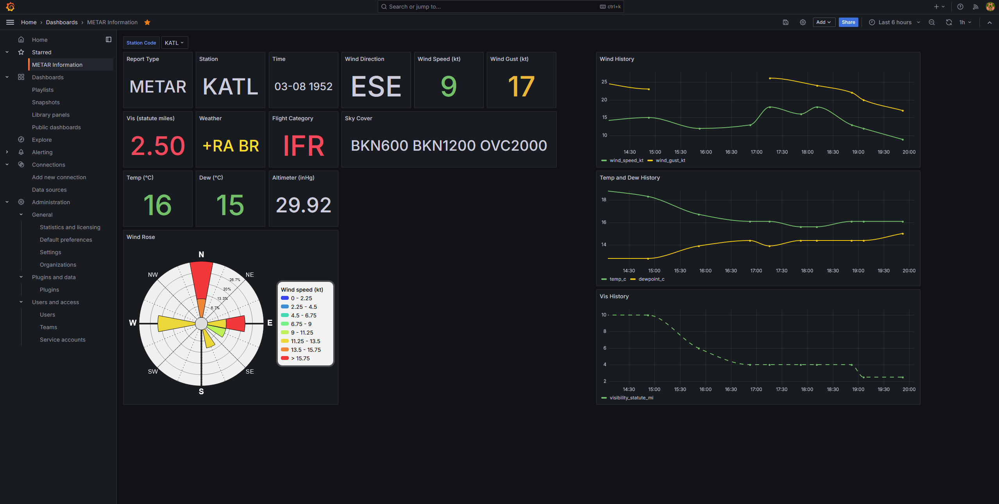

# metar

Retrieves latest METARs from NOAA Aviation Weather Center and inserts data into a Postgres database. You can read more [here](https://aviationweather.gov/data/api/).

Do not use this script for real-world navigation.

Here is an example use case in grafana.

## Install

    $ git clone https://github.com/smehlhoff/metar.git
    $ cd metar
    $ python3.11 -m venv venv
    $ source venv/bin/activate
    $ pip install -r requirements.txt

Ensure the following environmental variables are set:

    POSTGRES_DB=
    POSTGRES_HOST=
    POSTGRES_PASSWORD=
    POSTGRES_PORT=
    POSTGRES_USER=

## Usage

    $ python main.py --stations --metars    # retrieve stations + metars

## Limitations

This script retrieves U.S. METARs only (e.g., KSFO, KJFK).

## Contributing

Pull requests are welcome. For major changes, please open an issue first to discuss what you would like to change.

## License

[MIT](https://github.com/smehlhoff/metar/blob/master/LICENSE)
