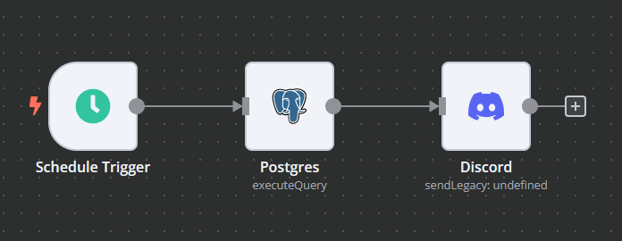
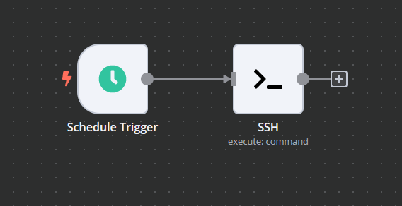

## Deploy to Docker

1. docker volume create n8n_data

2. docker run -it --detach --rm --name n8n -p 5678:5678 -v n8n_data:/home/node/.n8n docker.n8n.io/n8nio/n8n

3. navigate to metar folder

4. docker compose -f dev.yml up --detach --build

5. docker network connect metar_backend_network n8n

6. log into n8n and create ssh client

    - host: ubuntu_server

7. create workflow

    - command: source /home/dev/metar/venv/bin/activate && python /home/dev/metar/main.py --metars && deactivate

8. log into ubuntu_server as dev

9. cd /home/dev

10. nano setup.sh

11. copy and paste setup.sh

12. chmod +x setup.sh

13. ./setup.sh

14. activate workflow in n8n

## Example workflows for n8n

